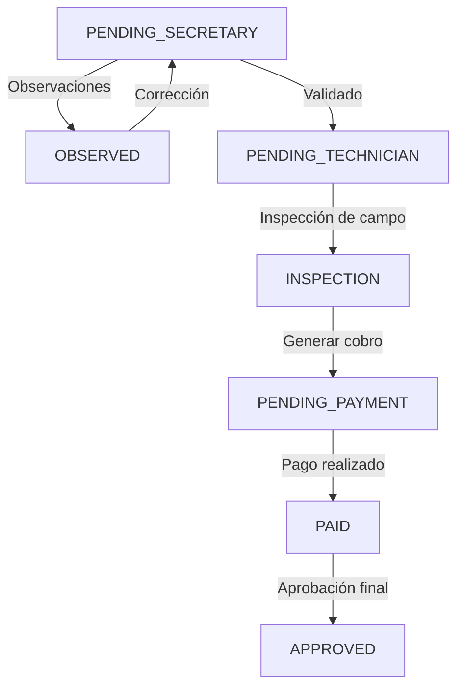

# Informe Técnico y Funcional del Sistema

**Sistema Municipal de Trámites, Verificación de Firmas Electrónicas y Gestión de Términos y Condiciones**  
_Estándar de Documentación: Orientado a SRS IEEE 830_

---

## 1. Introducción y Propósito del Sistema

El propósito de este sistema es digitalizar y optimizar la gestión de trámites municipales clave (Línea de Fábrica, Aprobación de Planos y Permisos de Construcción) garantizando la validez legal de las actuaciones ciudadanas y profesionales mediante firmas electrónicas, y asegurando el cumplimiento normativo a través de la aceptación de políticas y términos de uso del sistema.

### Objetivos Principales:

- **Gestión de Flujos Administrativos**: Proveer una plataforma intuitiva para ciudadanos, arquitectos y funcionarios municipales.
- **Autenticidad e Integridad**: Validar las firmas electrónicas contra un registro base y reportar cualquier discrepancia al rol de Secretaría.
- **Cumplimiento Normativo (Aislado)**: Presentar y almacenar de forma estática la aceptación de los Términos y Condiciones del sistema para evitar confusiones operativas.

---

## 2. Pila Tecnológica (Architecture Stack)

El sistema ha sido estructurado en tres capas desacopladas para garantizar el rendimiento, la escalabilidad y la facilidad de mantenimiento:

| Capa              | Tecnología / Librería             | Función Principal                                                                       |
| :---------------- | :-------------------------------- | :-------------------------------------------------------------------------------------- |
| **Frontend**      | **React** (+ React Router, Axios) | Interfaz de usuario interactiva y SPA responsive para ciudadanos y funcionarios.        |
| **Backend**       | **Nest.js** (TypeScript)          | API REST modular, controlador de la máquina de estados y despachador de notificaciones. |
| **Capa de Datos** | **PostgreSQL** + **Prisma ORM**   | Persistencia relacional de trámites, logs de firmas y control de transiciones.          |

---

## 3. Arquitectura Funcional y Reglas de Negocio

### 3.1. Gestión de Firma Electrónica (Verificación y Alertas)

El sistema implementa una lógica de contraste de firma electrónica estricta para prevenir la suplantación de identidad y asegurar la validez legal del firmante:

1.  **Registro Inicial**: El ciudadano o arquitecto registra una firma electrónica base por primera vez en el sistema.
2.  **Contraste Continuo**: Cada vez que se firme o cargue un documento para un trámite, el sistema compara de forma automática el identificador/firma ingresada con la registrada inicialmente.
3.  **Lógica de Excepción e Inconsistencia**:
    - Si las firmas coinciden, el trámite continúa su flujo normal.
    - Si las firmas **no coinciden**, el sistema detiene la transición del trámite y despacha de manera inmediata una alerta/notificación en tiempo real al rol de **Secretaría** (rol administrativo responsable) para su auditoría manual y bloqueo del trámite.
4.  **Cumplimiento de Estándares**: El módulo se rige bajo la legislación nacional de comercio electrónico y firmas electrónicas, garantizando la inalterabilidad de los registros.

### 3.2. Gestión de Términos, Condiciones y Políticas (Módulo Aislado)

Para evitar errores de desarrollo, conflictos de consistencia de base de datos y facilitar futuras auditorías legales:

- **Lógica Desacoplada (Sin Conexión)**: Las políticas de uso de datos, políticas de manejo de datos, términos y condiciones para ciudadanos, arquitectos y funcionarios se estructuran de manera aislada.
- **Visualización Estática**: Se presentan en el frontend mediante componentes estáticos. La aceptación se registra mediante un check de estado sencillo en la sesión, sin necesidad de integraciones complejas de base de datos que introduzcan dependencias de red o bloqueo de hilos.

---

## 4. Máquina de Estados de los Trámites

El ciclo de vida de los trámites (Línea de Fábrica, Aprobación de Planos, Permisos de Construcción) se gestiona de forma centralizada en el backend de Nest.js a través de los siguientes estados consecutivos:

### Descripción de los Estados del Flujo:

1.  **`PENDING_SECRETARY`**: Estado inicial. El trámite ingresa y espera la revisión documental por parte del rol de Secretaría.
2.  **`OBSERVED`**: El trámite es rechazado temporalmente debido a errores documentales. Se devuelve al ciudadano para corrección.
3.  **`PENDING_TECHNICIAN`**: Documentación aprobada. Se asigna a un técnico municipal para su revisión de factibilidad.
4.  **`INSPECTION`**: Se planifica y ejecuta la inspección técnica en el terreno o predio.
5.  **`PENDING_PAYMENT`**: El informe técnico es favorable y se calcula la tasa municipal. Esperando pago del ciudadano.
6.  **`PAID`**: El ciudadano ha efectuado el pago correspondiente en los canales municipales autorizados.
7.  **`APPROVED`**: Trámite finalizado con éxito. Se genera el documento resolutivo (ej. Permiso de Construcción) firmado electrónicamente por la autoridad competente.

---

## 5. Casos de Uso y Requerimientos del Sistema (SRS IEEE 830)

### 5.1. Requerimientos Funcionales Clave (RF)

- **RF-01**: El sistema debe permitir el registro de una firma electrónica base única para cada usuario.
- **RF-02**: El sistema debe verificar en cada trámite que la firma utilizada coincida exactamente con la firma registrada en RF-01.
- **RF-03**: El sistema debe notificar al rol de Secretaría si una validación de firma falla, pausando el trámite.
- **RF-04**: El sistema debe gestionar las transiciones de trámites a través de los estados definidos (PENDING_SECRETARY → APPROVED).
- **RF-05**: El sistema debe presentar componentes visuales independientes para la aceptación de Términos y Condiciones y Políticas de Manejo de Datos.

### 5.2. Historias de Usuario (Ejemplos)

- **Como Secretaría**, quiero recibir alertas inmediatas de firmas no válidas para evitar fraudes en la aprobación de planos.
- **Como Ciudadano**, quiero firmar digitalmente mi solicitud de Permiso de Construcción utilizando mi firma electrónica registrada previamente.
- **Como Funcionario Técnico**, quiero cambiar el estado de un trámite a `INSPECTION` para registrar mis observaciones de campo.

---

## 6. Manuales y Sistematización Técnica

### 6.1. Manual Técnico (Resumen)

- **Estructura del Repositorio**:
  - `/src/modules/trámites`: Controladores y servicios de Nest.js para el motor de estados.
  - `/src/modules/firmas`: Lógica de comparación hash de firmas.
  - `/prisma/schema.prisma`: Definición de los esquemas PostgreSQL (`SignatureRegistry`, `Tramite`, `TermsAcceptance`).
- **Mantenimiento**: La lógica de verificación de firmas está aislada en `SignatureService` para facilitar actualizaciones legales sin alterar el motor de estados de los trámites municipales.

### 6.2. Manual de Usuario (Perfiles)

- **Ciudadano**: Accede al sistema, firma el acuerdo de términos y condiciones (vía check estático) e ingresa su firma electrónica inicial para tramitar Líneas de Fábrica o Planos.
- **Arquitecto**: Carga planos técnicos y firma electrónicamente los documentos de diseño.
- **Secretaría**: Recibe trámites en estado `PENDING_SECRETARY`, valida la documentación general y visualiza en su dashboard las alertas críticas si el sistema detecta que una firma de arquitecto o ciudadano no coincide con el registro original.
